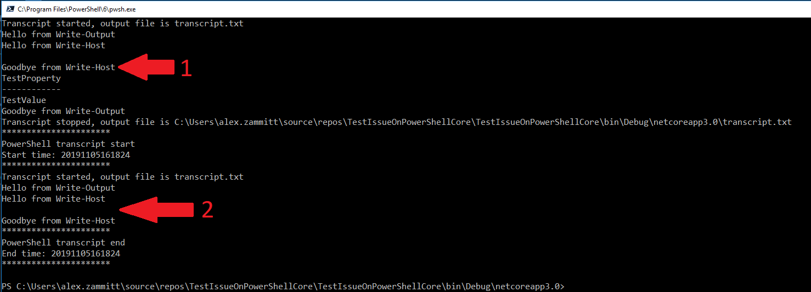

# Start/Stop Transcript Issue

Start/Stop transcript does not always capture all output written to the PowerShell console.  

When calling a Cmdlet that uses WriteObject to output data, there appears to be a delay that backs up the output pipeline.  This results in the output to not be captured when Stop-Transcript is called.  [Test-TranscriptIssue.cs](TestIssueOnPowerShellCore/Test-TranscriptIssue.cs) is an example of such Cmdlet.

## How to reproduce

Given the script below (Note: The project file in this repo is configured to run this script when launched in visual studio):

```
Start-Transcript -Path transcript.txt -UseMinimalHeader

Write-Output "Hello from Write-Output"
Write-Host "Hello from Write-Host"

Test-TranscriptIssue

Write-Output "Goodbye from Write-Output"
Write-Host "Goodbye from Write-Host"

Stop-Transcript

# Write out the transcript to the console
cat ./transcript.txt
```
We get the following output:


There are two interesting observations here:
1) `Goodbye from Write-Output` is appearing before the output of `Test-TranscriptIssue`.   Is `Test-TranscriptIssue` introducing a delay to the output pipeline?
2) The output of `Test-Transcript` and `Goodbye from Write-Output` is missing from the transcript.

## Other notes & thoughts
- We were only able to reproduce this with Cmdlets that use WriteObject (as seen in [Test-TranscriptIssue.cs](TestIssueOnPowerShellCore/Test-TranscriptIssue.cs)).   If we replace `Test-TranscriptIssue` with `Get-Module` in the script, everthing seems to work as expected.
- It feels like WriteObject is introducing a delay to the output pipeline that is causing Stop-Transcript to write to file before it is finished processing.
- Is WriteObject the right thing to be using in Cmdlets?
